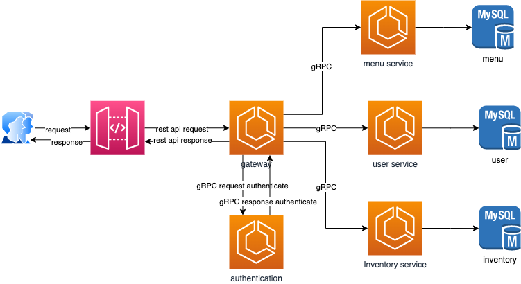

# Table system
## Technical stack
> nodejs 16: compile js for backend side
> 
>> Typescript 4: Programming language to setup code script
>
>> Nestjs Framework: implementing microservice architecture which base on setup project
> 
> > Mysql database
> 
> > gRPC as communication bus for backend service
> 
> > Redis cache to setup for metadata or info which live in short time
> 
## Microservice service decomposition
> - **Menu service**: Manage dish of restaurants
>
> - **Inventory service**: Manage booking time for serving table
>
> - **User service**: Manage user of restaurants
> 
> - **Gateway**: To expose api list for web or app, interact with authorization system
> 
> - **Authorization**: Manage to authenticate and authorize user
## Database decomposition
In the project, I used data per service to manage data so that database also will be separated for specific service
> - **Menu database**: database to manage info of **menu service**
> - **Inventory service**: To manage info of **Inventory service**
> - **User service**: To manage info od **User service**
## High level architecture

## Coding structure
>> project
>
> >> src
> >>> controller: expose API for client side
> 
> >>> services:  handle business user case of the service
> 
>  >>>> repositories:  interact with directly with database to manipulate
> 